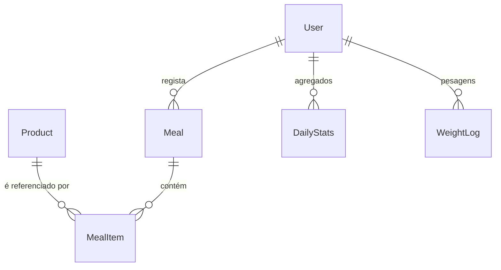

# ARCHITECTURE.md — NutriScore

> Documento de arquitetura do projeto **NutriScore — Alimentação Consciente (Offline‑First)**. Foca-se na **estrutura** do sistema (o quê e como se organiza), sem entrar em detalhes de implementação.

---

## 1. Objetivo & Escopo
- **Objetivo**: Aplicação móvel para registo de refeições e análise nutricional simplificada, com **NutriScore (A–E)**, a operar **offline-first**.
- **Escopo**: App Flutter com base de dados local **SQLite**; **fallback online** à **Open Food Facts (OFF)** apenas quando um produto não existe na base local.
- **Fora do escopo (MVP)**: sincronização multi-dispositivo, backend próprio e telemetria externa.

---

## 2. Contexto do Sistema
- **Cliente**: Aplicação móvel Flutter (Android/iOS).
- **Fontes de dados**: 
  - **Primária**: Base local `nutriscore.db` (SQLite).
  - **Secundária**: Open Food Facts (consulta remota somente em falta de dados locais).
- **Dependências do dispositivo**: câmara (scanner), armazenamento local, rede (opcional para fallback).

```mermaid
flowchart LR
  User((Utilizador)) --> App[App NutriScore (Flutter)]
  App -->|Leitura/Escrita| SQLite[(SQLite on-device)]
  App -->|Fallback (HTTP)| OFF[Open Food Facts]
```

---

## 3. Arquitetura por Camadas (High-Level)
- **UI (Flutter)**: ecrãs, componentes e navegação; theming centralizado via `theme.dart` (cores, tipografia e spacing).
- **Aplicação / Use Cases**: orquestra regras de negócio da app (registos, pesquisa, cálculo de totais).
- **Repositórios**: expõem operações de dados; decidem entre **DAO local** e **cliente OFF** (fallback).
- **Acesso a Dados (DAO/Drift)**: queries tipadas para SQLite; migrações e índices.
- **Armazenamento**: ficheiro **`nutriscore.db`** no dispositivo.

```mermaid
flowchart TB
  subgraph UI[UI (Flutter)]
  end
  subgraph APP[Aplicação / Use Cases]
  end
  subgraph DATA[Dados]
    REPO[Repositórios]
    DAO[DAOs / SQLite]
    DB[(nutriscore.db)]
  end
  subgraph EXT[Externo]
    OFF[Cliente OFF (HTTP)]
  end

  UI --> APP --> REPO
  REPO --> DAO --> DB
  REPO --> OFF
```

---

## 4. Modelo de Dados (visão geral)
- **Product**: identificação (barcode, nome, marca), **NutriScore (A–E + score)**, **NOVA**, macros por 100g/porção, metadados (categorias, alergénios, imagem) e `off_raw` (payload bruto OFF).
- **Meal**: registos por dia e tipo (BREAKFAST/LUNCH/DINNER/SNACK), totais agregados.
- **MealItem**: itens associados a uma refeição (quantidade, unidade).
- **DailyStats**: agregados diários (calorias/macros) por utilizador.
- **WeightLog**: evolução de peso diária.
- **Histórico / Favoritos**: auditoria de pesquisas e atalhos a itens frequentes.
- **Índices**: `Product(name)`, `Product(brand)`, `Product(categories)` para pesquisa rápida.
- **Regras**: `CHECK` para enums; triggers `updatedAt` para auditoria.



---

## 5. Fluxos de Dados (high-level)
### 5.1 Offline (principal)
1. **Scan/Pesquisa** → consulta **SQLite** por barcode ou texto.
2. **UI** apresenta detalhes, permite adicionar a refeições.
3. **Registo** atualiza `Meal`, `MealItem` e **agregados** (`DailyStats`).

### 5.2 Fallback Online (apenas em falta de dados)
1. Miss local → chamada à **OFF** com **rate‑limit** e backoff.
2. **Normalização** dos campos para o nosso modelo.
3. **Upsert** no SQLite (inclui `off_raw`) e atualização de `lastFetchedAt`.
4. UI mostra o produto; próximas consultas passam a ser **offline**.

```mermaid
sequenceDiagram
  participant UI
  participant Repo
  participant SQLite
  participant OFF as Open Food Facts
  UI->>Repo: getProduct(barcode)
  Repo->>SQLite: SELECT ... WHERE barcode=?
  SQLite-->>Repo: not found
  Repo->>OFF: HTTP GET /product/{barcode}
  OFF-->>Repo: 200 OK (JSON)
  Repo->>SQLite: UPSERT Product + off_raw
  Repo-->>UI: Product normalizado
```

---

## 6. Estratégia Offline‑First
- **Local-first**: todas as operações críticas (consulta, registo, estatísticas) funcionam **sem rede**.
- **Base inicial**: `nutriscore.db` pré‑construída por pipeline (CSV→SQLite).
- **Retenção**: os dados remotos ficam guardados localmente para reutilização futura.
- **Atualização**: somente quando ocorrer fallback online, com cache condicional (ETag/Last-Modified) quando disponível.

---

## 7. Integração Externa (Open Food Facts)
- **Uso**: apenas quando o produto não existe em SQLite.
- **Boas práticas**: **rate‑limit**, **exponential backoff**, **User‑Agent** identificável, **sem PII** (apenas barcode).
- **Cache condicional**: validação por ETag/Last‑Modified para reduzir tráfego.
- **Transparência**: preservação do payload bruto em `off_raw`.

---

## 8. UX & Design System (ligações arquiteturais)
- **Theming central**: todas as cores, tipografia e spacing via **`theme.dart`** (Fresh Green para CTAs, etc.).
- **Acessibilidade**: contraste mínimo **WCAG AA**; não depender só de cor.
- **Estados previsíveis**: carregamento/sucesso/erro consistentes; mensagens padrão (“Tentar novamente”, “Adicionar alimento personalizado”).

---

## 9. Segurança & Privacidade (nível arquitetural)
- **Armazenamento local**: dados no SQLite/ficheiros do app sandbox.
- **Princípio do mínimo privilégio**: câmara e rede apenas quando necessário.
- **Privacidade**: chamadas à OFF **não** incluem PII; apenas o **barcode**.
- **Autenticação local**: hashing e proteção de dados sensíveis a nível de app (quando aplicável).

---

## 10. Performance (nível arquitetural)
- **Índices** para pesquisa rápida (`name`, `brand`, `categories`).
- **Cálculo** no momento do registo; **agregados** em `DailyStats` para leitura eficiente.
- **I/O**: evitar operações pesadas no main thread; gestão de imagens e cache local.

---

## 11. Configuração & Ambientes
- **Parâmetros** centralizados: caminhos de BD, limites de taxa, user‑agent.
- **Ambientes**: desenvolvimento e release (flavors opcionais).

---

## 12. Observabilidade (local)
- **Logging leve** de eventos críticos: scan, fallback, upsert, erros de rede.
- **Sem telemetria externa** no MVP (pode ser evoluído futuramente).

---

## 13. Testes (abrangência arquitetural)
- **Unit** (mapeamentos e regras), **Widget** (componentes UI) e **Integração** (DAOs com DB in‑memory; cliente OFF mockado).
- **Cenários críticos**: scan→fallback→upsert; 404/429/5xx; migrações de schema.

---

## 14. Diagramas (resumo)
- **Contexto**: App ↔ SQLite ↔ OFF.
- **Camadas**: UI → Use Cases → Repositórios → DAO → DB; Repositórios → OFF.
- **Fluxo Fallback**: miss local → OFF → normalização → upsert → UI.
- **ER Simplificado**: principais entidades e relações.

---

## 15. Evolução Futura (linha de rumo)
- Preferências/alertas (ex.: muito sal), alternativas saudáveis, rankings por categoria, notificações, gráficos semanais/mensais, exportação CSV e, eventualmente, sincronização.

---

**Notas finais**  
- Manter a consistência visual e comportamental via `theme.dart`.  
- O **offline-first** é a prioridade; o online serve apenas para colmatar lacunas de dados.
